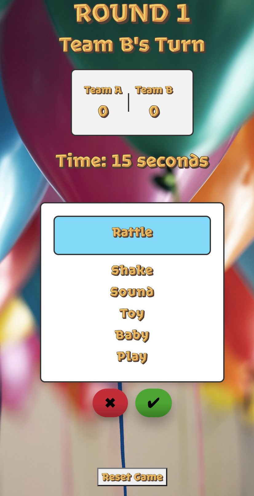
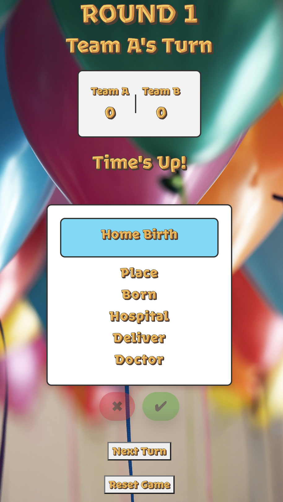

# Baby Shower Taboo Game

## Overview

This repository contains a Baby Shower Taboo Game, a web application built with React. The game is designed for baby shower celebrations, providing an entertaining and interactive experience for participants. 
I personally built this game for a friend's baby shower, and it was a total hit! :)

## Game Description

The Baby Shower Taboo Game is a digital version of the classic [Taboo game](https://playtaboo.com/rules-of-the-taboo-game/) with a baby shower theme. Players take turns trying to get their team to guess a word without dropping any of those **Taboo** words that usually go with it. The game includes a set of predefined words and taboo words related to babies and parenting. 

### Additional Game Information
* The game involves two teams, with Team A initiating the gameplay.
* Players can customize the number of rounds and set a time duration for each round according to their preferences.
* The (&#10003;) button, or **Correct** button, enables users to award their team a point when they successfully guess a word.
* The (X) button, or **Taboo** button, allows users to skip a card they find challenging or want to pass on.
* Players tap the **Next Turn** button to switch to the next team's round after one team finishes their turn - when the timer runs out.
* Players can tap the **Reset Game** button to initiate a game restart.
* The winning team is determined by the highest accumulated points at the end of the game.
* Players have the flexibility of unlimited passes during the game.
* A total of 90 cards are available, ensuring a diverse and engaging gameplay experience.


## Dependencies

The project was initiated using [Create React App](https://github.com/facebook/create-react-app), a popular tool for bootstrapping React applications. The primary dependencies include Node.js, npm (Node Package Manager), React, and other related packages. 

## Continuous Integration (CI) and Continuous Deployment (CD)

This repository utilizes GitHub Actions for Continuous Integration (CI) and Continuous Deployment (CD) to ensure code quality and successful deployment. You can choose to integrate it into your personal workflow.

### Dependency
- Generate a Personal Access Token (PAT) by going to GitHub `Settings > Developer settings > Personal access tokens`.
- Name it `PAT` and add it as a secret in the repository under `Settings > Secrets and variables > Actions`.

The CI/CD pipeline is defined in `.github/workflows/ci.yml` and includes the following steps:
- Checkout the code.
- Set up the Node.js environment.
- Install dependencies.
- Verify React installation.
- Run tests.
- Build the project.
- Set git user for deployment.
- Deploy to GitHub Pages.

The CI/CD pipeline is triggered on every push to the `main` branch and on pull requests to `main`. The deployment to GitHub Pages is handled automatically, so there's no need to manually deploy from your local environment.

## Local Development

After cloning the code to your local environment, follow these steps to run the game locally:

1. Navigate to the project root directory:

```
cd Baby-Shower-Taboo
```
2.  Install dependencies:

```
npm install
```

3. Start the development server:
```
npm start
```

This runs the app in the development mode.\
Open [http://localhost:3000](http://localhost:3000) to view it in your browser.

The page will reload when you make changes.\
You may also see any lint errors in the console.


## Deployment to GitHub Pages
The Baby Shower Taboo Game can be deployed to GitHub Pages for online accessibility. Detailed instructions can be found on the [react-gh-pages repo](https://github.com/gitname/react-gh-pages?tab=readme-ov-file#deploying-a-react-app-to-github-pages).

After cloning the code to your local environment, follow these steps:

1. Change the "homepage" value in the `package.json` file to your GitHub username:
```
"homepage": "https://<username>.github.io/Baby-Shower-Taboo/",
```
2. Make sure your changes are committed and pushed to the `main` branch (This maintains a record of your source code):
```
git checkout main
git add .
git commit -m "Your commit message"
git push origin main
```
3. Create `gh-pages` Branch and switch to it:
```
git checkout -b gh-pages
```

4. Merge changes from `main`, and then push to the `gh-pages` branch:
```
git reset --hard main
git push origin gh-pages --force
```
5. Deploy to GitHub Pages ([More info on this](https://github.com/gitname/react-gh-pages?tab=readme-ov-file#8-configure-github-pages)): 
```
npm run deploy
```

This command will build the application and deploy it to the `gh-pages` branch, making it accessible at `https://<username>.github.io/Baby-Shower-Taboo/`.

## Directory Structure
* `src:` Contains the source code for the React application.
* `public:` Includes the public assets and the HTML template for the application.
* `build:` Holds the production build of the application.
* `public/images:` Stores images used in the project.
  
## How It Looks

<br>
<br>

<br>
<br>

<br>

### Enjoy your baby shower celebration and happy coding! :)
